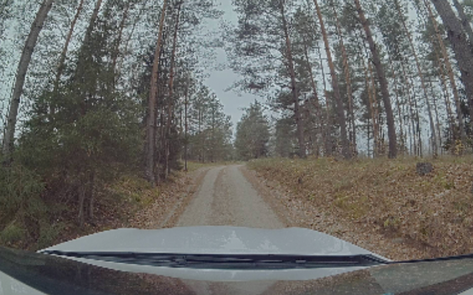

# Evaluating Steering Models using VISTA Driving Simulator

This is a road-following benchmark for camera-based end-to-end steering models that uses the [VISTA Driving Simulator](https://github.com/vista-simulator/vista). 

VISTA takes a recording of a real-world drive and allows replaying it interactively with deviations from the original trajectory by reprojecting the view-point as desired. Thus, a simulator can be used for on-policy, closed-loop evaluation, allowing fast and reproducible model evaluation while staying visually in-distribution with real-world data.

The [Rally Estonia End-to-End Driving](https://github.com/UT-ADL/e2e-rally-estonia) provides a dataset and codebase for training baseline models.

## Task

The evaluation is done on a VISTA-simulated 4.3 km section of the WRC Rally Estonia 2022 [SS10+14 Elva](https://www.rally-maps.com/Rally-Estonia-2022/Elva) track, driven in both ways (8.6 km in total). The track was chosen to be challenging for humans, and includes elevations, curves and narrow rural roads. The speed in the original recording is around 35-45 km/h, chosen to be comfortable by the driver.

The only inputs available to the model are RGB image frames from the front-facing camera. The model is expected to output a steering angle in radians, where positive angles are left turns. The longitudinal (speed) control is not evaluated and is taken from the ground truth speed at the moment of the frame capture.



## Download Traces

The VISTA simulator is run on *traces*, i.e. drive recordings in a VISTA-specific format. 

Download the official benchmark [traces](https://owncloud.ut.ee/owncloud/s/MpcyyzSC7qdgc2d) from the University of Tartu ownCloud. The archive contains two directories with traces, representing two drives through the track in different directions: 
- `2021-10-26-10-49-06_e2e_rec_ss20_elva_eval_chunk` (4.3km section of SS10+14 Elva)
- `2021-10-26-11-08-59_e2e_rec_ss20_elva_back_eval_chunk` (4.3km section of SS10+14 Elva, reversed)

Put the traces into the `traces` folder in the root of the repository.

> If you'd like extra, unofficial evaluation traces, you can:
> - use VISTA-provided [sample traces](https://www.dropbox.com/s/62pao4mipyzk3xu/vista_traces.zip?dl=1)
> - create your own trace. An example script creating a trace from a ROS bag is included.
> - (only members of the Autonomous Driving Lab at University of Tartu) use additional created traces from Oct 2021 and Sep 2022 Elva bags, found in `<shared-directory>/end-to-end/vista` on HPC. Use only the ones with `-resize` in the end of the name.

## Requirements

1. Linux (tested on Ubuntu 18.04 and CentOS 7.9)
2. An Nvidia GPU with at least 2GB of memory. More memory — more parallel evaluations.

## Install

0. Ensure to have VISTA's system dependencies:

```bash
sudo apt-get update
sudo apt-get install -y freeglut3-dev
sudo apt-get install -y libglib2.0-0
sudo apt-get install -y ffmpeg
```

1. Create a [conda](https://docs.conda.io/en/latest/miniconda.html) environment with Python 3.8 and activate it.

```bash
conda create -n vista python=3.8
conda activate vista
```

2. Install core python dependencies:

```bash
pip install -r requirements.txt
```

3. (optional) Install ROS dependencies (only necessary for creating custom VISTA traces from your bag files):

```bash
pip install --extra-index-url https://rospypi.github.io/simple/ rospy rosbag roslz4 cv-bridge
```

4. Install our fork of VISTA:
```bash
pip install git+https://github.com/UT-ADL/vista.git
```

Our [fork](https://github.com/UT-ADL/vista) has the following improvements:
- added monocular depth estimation using [monodepth2](https://github.com/nianticlabs/monodepth2) for artifact-free view reprojection
    - the original [VISTA paper](https://ieeexplore.ieee.org/document/8957584) reported using monocular depth estimation in their experiments, citing [monodepth](https://github.com/mrharicot/monodepth), but the authors did not include it in the codebase
- added a learned vehicle dynamics model to simulate the effect of a real car's actuators smoothing the predicted steering angle
- fixed a bug that in rare cases created zero-length segments which made the simulator crash

## Usage

Scripts:

> Use the `--help` flag when calling a script to see the full list of arguments.

- evaluate.py - run a model on a set of VISTA traces and calculate the number of crashes. Main args:
    - `--model` - path to the steering model ONNX file to evaluate, **required**
    - `--traces` - names of traces in the `--trace-root` directory (`./traces` by default) to run evaluation on, **required**
    - `--trace-root` - path to the folder containing the traces to evaluate on,
    - `--wandb-project` - if provided, results are logged to Weights & Biases.
- create_trace.py - an example script to create a VISTA trace from a ROS bag. Uses topics:
    - RGB camera: `/interfacea/link2/image/compressed`
    - speed: `/ssc/velocity_accel_cov`
    - curvature: `/ssc/curvature_feedback`


